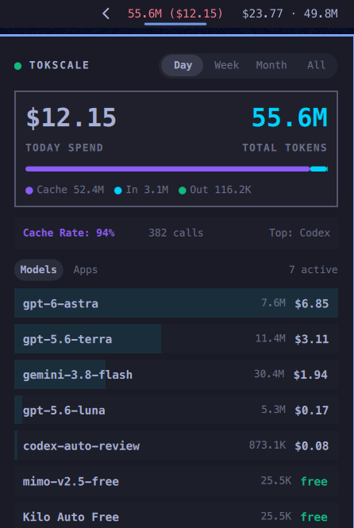

# Tokscale for Omarchy

Status bar widget for [Omarchy](https://omarchy.org) that tracks AI token usage and costs via [Tokscale](https://github.com/tokscale/tokscale).

Shows daily, weekly, monthly, or all-time token count and spend on the bar, with a popup dashboard and terminal TUI shortcut.



## Features

- **Status bar pill:** Shows current token count and cost (e.g. `144.0M ($27.86)`).
- **Dashboard popup:** Left-click to inspect tokens, spend, cache rates, request counts, and breakdowns grouped by model or client application.
- **Time ranges:** Filter by today, this week, this month, or all time.
- **TUI shortcut:** Right-click to launch or focus `tokscale tui` in the terminal.
- **IPC support:** Control data refreshes and popup state via Quickshell IPC.

## Requirements

- Omarchy shell (`quickshell`)
- `tokscale` CLI installed on PATH:
  ```bash
  npm install -g tokscale
  # or
  pnpm add -g tokscale
  ```

## Installation

### Using the Omarchy CLI (recommended)

```bash
omarchy plugin add https://github.com/jwtiyar/omarchy-tokscale.git
```

Omarchy asks: `Place jwty.tokscale in which bar section?` (`right`, `center`, or `left`, defaulting to `right`), then enables and places the widget immediately.

### Script install

Clone the repository and run the install script:

```bash
git clone https://github.com/jwtiyar/omarchy-tokscale.git
cd omarchy-tokscale
./install.sh
```

The script validates the plugin, prompts you for bar placement (`right`, `center`, or `left`), and enables it.

### Manual install

Copy the files into your Omarchy plugin directory:

```bash
mkdir -p ~/.config/omarchy/plugins/jwty.tokscale
cp manifest.json BarWidget.qml status.sh open-tokscale.sh ~/.config/omarchy/plugins/jwty.tokscale/
chmod +x ~/.config/omarchy/plugins/jwty.tokscale/*.sh
```

Enable and place the widget on your bar:

```bash
omarchy plugin enable jwty.tokscale --section right
```

Or add `"jwty.tokscale"` to `bar.layout` in `~/.config/omarchy/shell.json`.

### Changing bar placement

Move the widget between sections anytime:

```bash
omarchy plugin enable jwty.tokscale --section center
# or
omarchy plugin enable jwty.tokscale --section left
# or
omarchy plugin enable jwty.tokscale --section right
```

## Controls

| Action | Result |
| :--- | :--- |
| Left click bar pill | Toggle dashboard popup |
| Middle click bar pill | Refresh token data |
| Right click bar pill | Open or focus `tokscale tui` |
| Click 󰑐 in popup header | Refresh token data |
| Escape | Close dashboard popup |
| Enter / Space / `r` | Refresh token data |

## IPC commands

```bash
# Refresh data
qs -p ~/omarchy/shell ipc call jwty.tokscale refresh

# Toggle popup
qs -p ~/omarchy/shell ipc call jwty.tokscale toggle

# Set period ('today', 'week', 'month', 'all')
qs -p ~/omarchy/shell ipc call jwty.tokscale setPeriod week

# Set breakdown view ('models', 'apps')
qs -p ~/omarchy/shell ipc call jwty.tokscale setMode apps

# Open TUI
qs -p ~/omarchy/shell ipc call jwty.tokscale launch
```

## Credits

- [Tokscale](https://github.com/tokscale/tokscale) for the CLI, data collection, and TUI.
- [Codeburn](https://github.com/getagentseal/codeburn) for design ideas and token tracking patterns.

## License

MIT © [jwty](https://github.com/jwtiyar)

